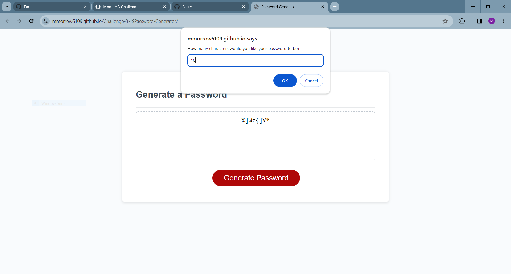
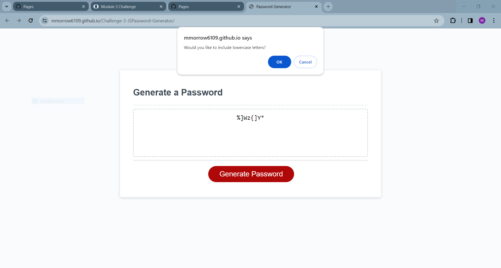
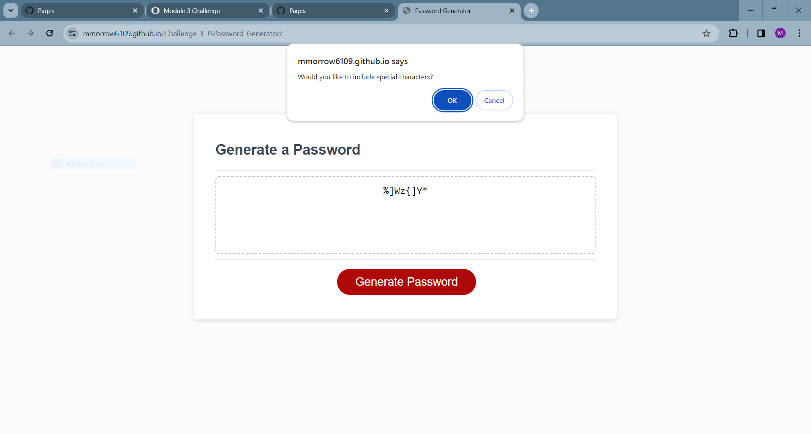
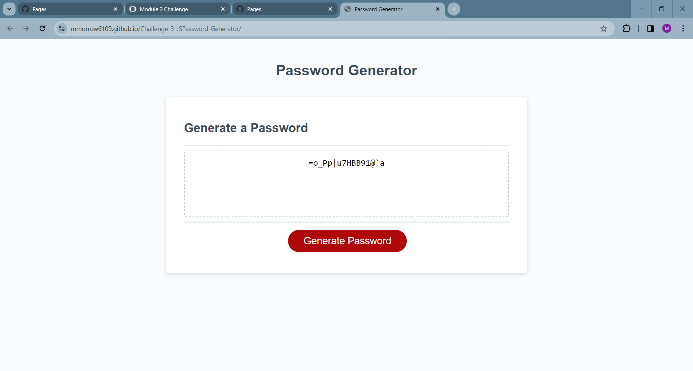

# Challenge 3: Creating a Password Generator with JavaScript

## Description

This week's challenge was to improve upon a prewritten code by creating a random password generator using JavaScript.  This exercise helped to further develop my understanding of how to write JS functions and how each piece of a JS file works together.  For example, the addEventListener needs to be placed at the bottom of the page given the cascading order of operations.  The exercise was also helpful with visualizing how JS can be written in multiple ways, ultimately performing the same function.  Rather than repeating myself with 5 if statement prompts, having the system "confirm" yes or no, is much cleaner and succinct on the code file.

##Credits

Matt Morrow

##License

N/A

## Features

- 4 string variables for each character set (lowercase, uppercase, numbers, and special characters)
- Prompt requiring input to define password
- Prompts confirming to units from all 4 character sets
- "if else" statement to ensure password meets set criteria
- optionsString variable used to consolidate all random choices into the final password output
- Math.floor(Math.random()) multiplied by the length of the optionsString variable used to pick characters at random from the index
- addEventListener triggers "function generatePassword ()"

## Link to Application

https://mmorrow6109.github.io/Challenge-3-JSPassword-Generator/

## Screenshots

